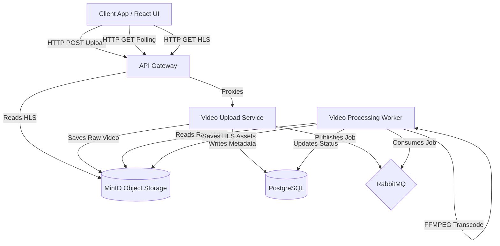

# Live Streamer

## Executive Summary

Live Streamer is a high-performance, asynchronous video processing and streaming platform designed for scalability and resilience. By leveraging an event-driven microservices architecture, the system efficiently ingests raw video assets, offloads intensive transcoding workloads, and delivers optimized HTTP Live Streaming (HLS) content to client applications. This decoupling ensures low latency on user-facing endpoints while allowing compute-heavy workers to scale horizontally.

## Technical Architecture

The platform utilizes a microservices architecture communicating via REST APIs and AMQP-based message queues. The `api-gateway` acts as the single entry point, routing requests to the `video-upload-service`, which persists metadata in PostgreSQL and streams raw video chunks directly to MinIO. To prevent request blocking, transcoding tasks are dispatched to RabbitMQ, where a pool of `video-processing-worker` instances asynchronously consume jobs, transcode media to HLS using `ffmpeg`, and store the resulting segments back in MinIO for client consumption.



## Key Features & Engineering Highlights

- **Asynchronous Event-Driven Processing:** Heavy FFMPEG transcoding tasks are offloaded to dedicated workers via RabbitMQ, ensuring the API Gateway remains highly responsive and available for concurrent uploads.
- **S3-Compatible Object Storage:** Utilizing MinIO isolates massive binary assets from the relational database, enabling scalable, high-throughput delivery of HLS playlists and segments.
- **Decoupled Microservices:** Bounded contexts isolate public routing (`api-gateway`), ingestion (`video-upload-service`), and processing (`video-processing-worker`), facilitating independent scaling and fault isolation.
- **Adaptive Bitrate Streaming Foundation:** Converts standard MP4 uploads into HLS (`.m3u8` / `.ts` segments), optimizing client-side playback performance across varying network conditions.
- **Containerized Infrastructure Parity:** Docker Compose orchestrates PostgreSQL, RabbitMQ, and MinIO, guaranteeing environment consistency from local development to production deployment.

## Tech Stack

**Backend & Core**

- TypeScript / Node.js
- NestJS (Microservices framework)
- TypeORM (Object-Relational Mapping)

**Frontend**

- React 19 / TypeScript
- Vite (Build tooling)
- HLS.js / React Player

**Infrastructure & Data**

- PostgreSQL 17 (Relational Metadata)
- RabbitMQ (AMQP Message Broker)
- MinIO (S3-Compatible Object Storage)
- Docker & Docker Compose (Container Orchestration)
- FFMPEG (Media Transcoding)

## Getting Started

### Prerequisites

- Node.js 20+
- pnpm 8+
- Docker and Docker Compose

### Local Development Setup

1. **Configure Environment**

   ```bash
   cp .env.example .env
   ```

2. **Start Infrastructure Services**
   Boot up PostgreSQL, RabbitMQ, and MinIO locally.

   ```bash
   docker compose up -d postgres rabbitmq minio minio-init
   ```

3. **Install Dependencies**

   ```bash
   pnpm install
   ```

4. **Run Microservices**
   Start the backend services in parallel (preferably in separate terminals or using a terminal multiplexer).

   ```bash
   pnpm backend:start:video-upload-service:dev
   pnpm backend:start:video-processing-worker:dev
   pnpm backend:start:api-gateway:dev
   ```

5. **Start the Frontend Application**

   ```bash
   pnpm frontend:start
   ```

*Alternatively, run the entire stack (services + infra) fully containerized:*

```bash
docker compose up --build
```

## API Documentation

The `api-gateway` exposes the following primary endpoints on `http://localhost:3001`:

- **`GET /`**
  Health check endpoint verifying gateway availability.

- **`POST /upload`**
  Accepts `multipart/form-data` with a `file` field. Ingests raw video, stores it in MinIO, creates a database record, and queues a processing job. Returns a `videoId` and initial `PENDING` status.

- **`GET /videos/:id`**
  Retrieves the current processing status (`PENDING`, `COMPLETED`, `FAILED`) and metadata (including the resolved `hlsPath` once finished) for a specific video upload.

- **`GET /hls/:videoId/:fileName`**
  Serves the processed HTTP Live Streaming assets. Used by client media players to fetch the master playlist (`index.m3u8`) and individual video segments (`.ts` files).
